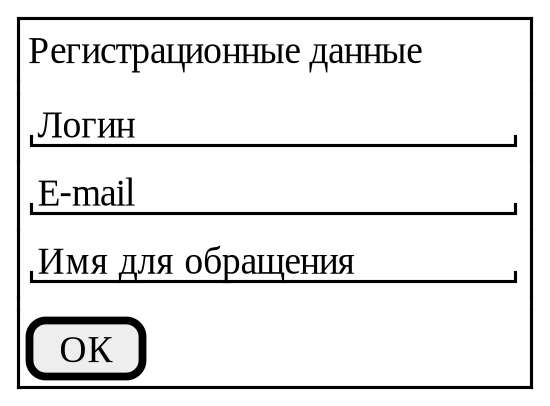
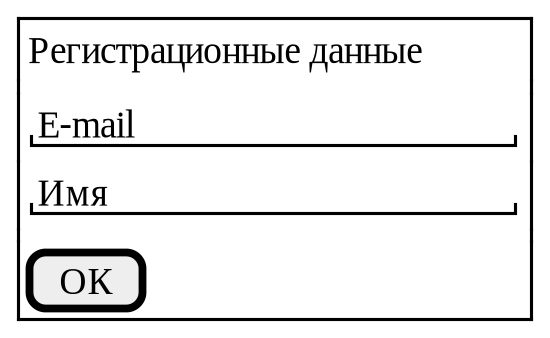
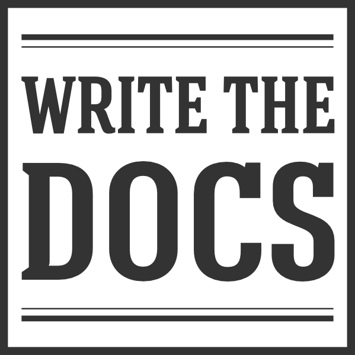
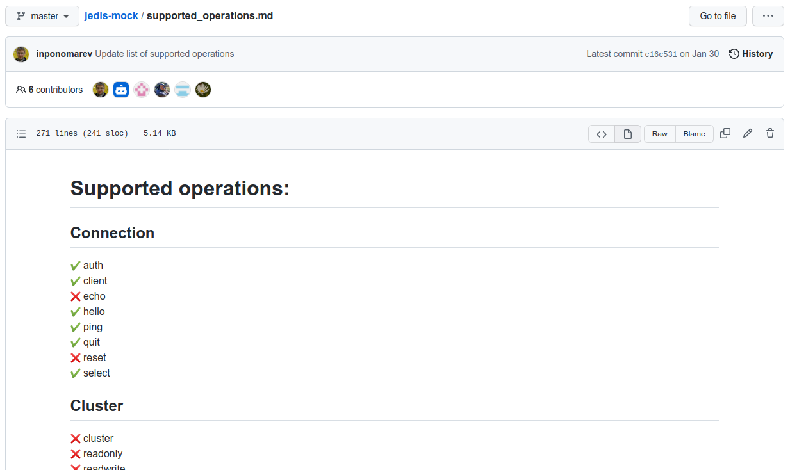
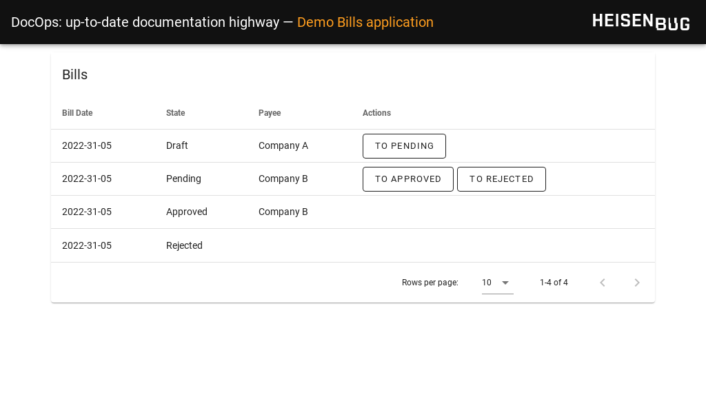
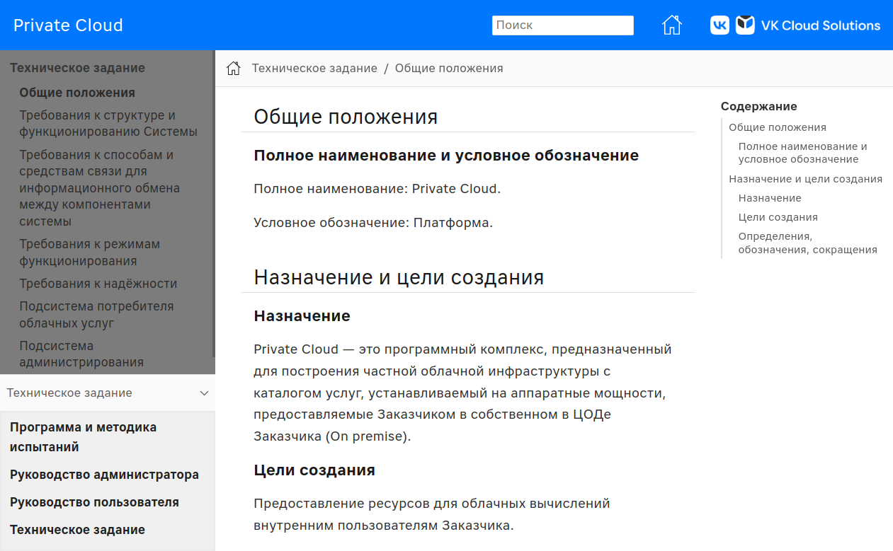

= DocOps++:++ Шоссе к актуальной документации: Up-to-date doc highway
:source-highlighter: rouge
:rouge-css: style
:revealjsdir: reveal.js
:revealjs_customtheme: white_course.css
:revealjs_slideNumber:
:revealjs_history:
:revealjs_progress:
:revealjs_mouseWheel: true
:revealjs_center: false
:revealjs_transition: none
:revealjs_width: 1600
:revealjs_height: 900
:icons: font
:figure-caption!:
:example-caption!:
:table-caption!:

[.title-footer]
[cols="260,1100,240"]
|===
a|
[.title-photo]

a|
[.fio]
Николай Поташников

Руководитель проектов, IT-архитектор +
КУРС-ИТ
.2+>.>a|
[.title-hb]

2+a|
[.contact]
icon:envelope[] consulting@yandex.ru {nbsp}{nbsp} icon:telegram[] @nmpotashnikov
|===

[[questionary]]
== **Опрос:** Кто использует в своей работе

* JavaDoc, foodoc, bardoc...
* Отчёты о тестировании (Allure, ...)
* Автоматическую документацию по спецификации API (GraphQL, OpenAPI, SOAP, ...)

// Приёмы непрерывной интеграции документации используют многие.

[[info]]
== О чём доклад

[.indent-before]
[.align-left]
В докладе я расскажу о практических приёмах непрерывного документирования, которые использую в работе.

[[actualityandcomprmise]]
== Насколько важна актуальность? Пример документирования карточки

.Выдержка из документации
[.indent-before]
====
* `Пользовательское имя` -- имя для входа в систему
* `E-mail` -- адрес электронной почты
* `Полное имя` -- имя для обращения
====

[[actualityandcomprmise1]]
=== Прошло время

.Документацию поменять забыли
[.indent-before]
[step=1]
====
* `Пользовательское имя` -- имя для входа в систему
* `E-mail` -- адрес электронной почты
* `Полное имя` -- имя для обращения
====

[[typescript]]
=== А если аналогичное несоответствие есть в коде?
.Cработает ли такой код на Typescript?
[.indent-before]
[source,typescript]
----
include::../../demo/10-typescript/cv.ts[]
----

[.indent-before]
[source, yaml]
[step=2]
----
login: ivanov1981
email: Ivan Ivanov
full name: undefined
----

=== Авось не выстрелит

=== Или всё же выстрелит?

IMPORTANT: Требования к качеству кода и документации не должны отличаться

== DocOps: варим актуальную документацию

[step=1]
[cols="1,5", frame="none", grid="none"]
|===
|
.^|“DocOps” is like DevOps. Instead of applying broadly to software development, though, DocOps specifically applies to the creation, management, and release of documentation.
|===

[step=2]
[plantuml,devops,svg,width=20%]
....
skinparam dpi 300
skinparam defaultFontName Liberation Sans
skinparam rectangleBackgroundColor White
skinparam rectangleBorderColor Black
skinparam rectangleBorderThickness 0
skinparam shadowing false
rectangle DevOps #EEEEEE {
    rectangle DocOps #BBBBBB
}
....

[step=2]
Документирование, разработка и доведение ИТ-продукта до конечного пользователя -- это единый взаимоувязанный процесс.

== Как обеспечить актуальность

[%step]
* Автогенерировать готовые куски документации
* Тестировать актуальность

== Источники формирования документации

[%step]
* Код реализации, код тестов
* DSL, переиспользуемые в коде и в документации
+
DSL -- domain specific language -- предметно-ориентированный язык программирования. Подробнее -- https://heisenbug-piter.ru/2021/spb/talks/1ymzgnw5v3mwh8xa5lj2dh/[Markus Voelter, Heisenbug, Питер 2021]
* Результат работы приложения в тестовой или продуктивной среде

//todo ссылка на доклад

== Объединим два предыдущих слайда в матрицу

include::basic-table.adoc[]

==  Какие-то клетки можно заполнить сразу

[.indent-before]
[cols="1,1,1", options=header]
|===
|
^.^|Автогенерация
^.^|Тестирование актуальности

|Код реализации, код тестов
|Javadoc, foodoc, bardoc...
|

|DSL
|SOAP, OpenAPI
|

|Результат работы приложения, в тестовой или продуктивной среде
|Allure, отчёты по тестированию
|
|===

[[asciidoc]]
=== Для понимания дальнейших примеров требуется Asciidoc

[%step]
* Название языка разметки -- Asciidoc
* Компиляторы
** Asciidoc (Python)
** Asciidoctor (Ruby, Java, JavaScript)

[[asciidoc-2]]
=== Пример разметки

[.indent-before]
[source, asciidoc]
------
Это *параграф*  <1>

.Исходный код
[source, java, indent=0]
----
include::some-file.java[tag=some-region] <2>
----

ifdef::is-administrator[Параграф, значимый только для администратора] <3>

ifndef::is-administrator[Параграф, лишний для администратора] <3>
------
<1> Задание параграфа, в котором слово «параграф» выделно жирным
<2> Вставка куска кода из java-файла
<3> Профилирование текста (отображение текста в зависимости от параметров сборки)

=== Результат предыдущего примера

:is-administrator:

[.align-left.indent-before]
====
[.align-left]
Это *параграф*

[.align-left.indent-before]
.Исходный код
[source, java, indent=0]
----
include::some-file.java[tag=some-region]
----

[.align-left.indent-before]
ifdef::is-administrator[Параграф, значимый только для администратора]

[.align-left.indent-before]
ifndef::is-administrator[Параграф, лишний для администратора]
====

__Предполагаем, что атрибут `is-administrator` установлен.__

== Рассмотрим кейс -- Схема обработки счёта

[plantuml, bill, svg]
....
skinparam dpi 200
skinparam defaultFontName Liberation Sans
skinparam shadowing false
skinparam StateBackgroundColor White
skinparam StateBorderColor Black
skinparam ArrowColor Black
state draft
draft --> pending
pending --> approved
pending --> rejected
....

//[.indent-before, step=1]
//Мы будем использовать следующие элементы:
//
//[.indent-before, step=2]
//.Вставка данных внешнего файла
//----
//\include::filename[]
//----
//
//[.indent-before, step=3]
//.Использование атрибутов
//----
//:my-attribute: Мое значение
//Здесь вы видите {my-attribute}
//----
//
//[.indent-before, step=4]
//.Профилирование
//----
//\ifdef::my-attribute[Отображаемый текст]
//\ifndef::my-attribute[Отображаемый текст]
//----

[[variant-1]]
== Вариант 1. Автогенерация документации на основе кода

:v1:
include::basic-table.adoc[]
:!v1:

[[variant-1-2]]
== Иногда достаточно просто поместить код в документацию

[.indent-before]
.Ожидаемый вид документации
====
.Далее приведен код реализации рабочего процесса работы со счётом
[source,groovy]
----
include::../../demo/20-bill-server/bill-processing.groovy[tag=pres, indent=0]
----
====

[[variant-1-3]]
=== Реализация

.`bill-processing.groovy`
[source, groovy]
----
//tag::bill-process-implementation[] <1>
include::../../demo/20-bill-server/bill-processing.groovy[tag=pres, indent=0]
...
//end::bill-process-implementation[] <1>
----
<1>  Тэгирование нужной части кода

[step=1]
[.indent-before]
.Код Asciidoc
----
\include::bill-processing.groovy[tag=bill-process-implementation, indent=0]
----

=== А если попробовать красиво параметризовать тест?

[source,groovy, indent=0]
----
  private static Stream<String> provideCorrectTransitions() {
    def doc = """tag::correct-transitions[]
      [draft] --> [pending]
      [pending] --> [approved]
      [pending] --> [rejected]
      end::correct-transitions[]"""
    return Stream.of(doc.split('\n')[1..-2] as String[]);
  }
----

[.indent-before]
.Сам тест
[step=1]
[source,groovy]
----
include::../../demo/20-bill-server/bill-processing.groovy[tag=processing-follows-model, indent=0]
----

=== Тогда в документации можем получить картинку

[.plantuml-contents]
====
.Схема рабочего процесса работы со счётом
[plantuml,from-test,svg,width="50%"]
....
left to right direction
state draft
include::../../demo/20-bill-server/bill-processing.groovy[tag=correct-transitions]
....
====

[step=1]
[.indent-before]
.Код Asciidoc
----
[plantuml,from-test,svg,width=50%]
....
left to right direction
state draft
\include::../../demo/20-bill-server/bill-processing.groovy[tag=correct-transitions]
....
----

=== Другой пример генерации документации по коду: Jedis-Mock

[.indent-before]
*Jedis-Mock* позволяет мокировать вызовы Redis для целей тестирования

[.indent-before]
.Задача
Отобразить все операции Redis и выделить реализованные

[.indent-before]
.Решение
* Каждая реализованная операция аннотируется
* При генерации документации автоматически сравнивается общий перечень команд, возвращаемых Redis, и список аннотированных команд
* Для аннотированных и неаннотированных команд реализуется различное оформление

=== Результат

[[variant-2]]
== Вариант 2. Тестирование изменения кода

:v2:
include::basic-table.adoc[]
:!v2:

[[variant-2-2]]
=== Требования к алгоритму тестирования изменения кода

* Код, меняющий поведение программы,  должен быть выделен
* Снимок (снэпшот) выделенного кода должен сохраняться в репозитории
* Документация должна содержать отметки, которые не позволяют сделать сборку, если соответствующий ей код изменился

[step=1]
[.indent-before]
Мы используем https://docs.asciidoctor.org/[Asciidoctor] и https://approvaltests.com/[Approval Tests]

[step=2]
[.indent-before]
TIP: Демонстрация

[[variant-3]]
== Вариант 3. Использование DSL для автогенерации документации

:v3:
include::basic-table.adoc[]
:!v3:

[[variant-3-1]]
=== Пример DSL для описания рабочего процесса работы со счётом

[step=1]
[source, json]
----
{
  "draft": ["pending"],
  "pending": [
    "rejected",
    "approved"
  ]
}
----

[step=2]
[.indent-before]
.В коде
JSON-DSL -> Map<String, Set<String>>

[step=3]
[.indent-before]
.В документации
JSON-DSL -> template -> adoc, plantuml

[[variant-3-2]]
=== Использование шаблонизаторов

.Шаблон Liquid
[source, liquid]
----



    
      {{ state[0] }} --> {{ to_state }}{{ bl }}
    

----

[.indent-before]
----
draft --> pending
pending --> approved
pending --> rejected
----

[[variant-3a]]
== Вариант 3а. Генерация документации на основе констант i18n

.Пример файла с константами
[source, json]
----
include::../../demo-bills/src/locales/en.json[]
----

[step=1]
[.indent-before]
.Пример файла с константами, адаптированного под Asciidoc
----
include::../../demo/30-bill-locale/en.adoc[]
----

=== Примерный вид отчёта

include::../../demo/30-bill-locale/en.adoc[]

====
.Возможные состояния счёта:
* {t-billStates-draft};
* {t-billStates-pending};
* {t-billStates-approved};
* {t-billStates-rejected}.
====

[step=1]
[.indent-before]
----
.Возможные состояния счёта:
* {t-billStates-draft};
* {t-billStates-pending};
* {t-billStates-approved};
* {t-billStates-rejected}.
----

[step=2]
NOTE: Аналогичным образом можно ввести константы для наименования действий

[[variant-4]]
== Вариант 4. Тестирование DSL

:v4:
include::basic-table.adoc[]
:!v4:

[[variant-4-1]]
=== Проверяем, что количество вложенных констант не изменилось
[.indent-before]
----
\ifndef::t-billStates-childs-count-4[{t-billStates-childs-count-4}]
----

== Примеры DSL, удобных для генерации документации

* Константы интернационализации
* BPMN
* GraphQL, OpenAPI, SOAP
* application.yaml
* GitHub/GitLab/Jenkins workflows
* ...

[[variant-5]]
== Вариант 5. Генерация документации по артефактам сборки. Скриншоты

:v5:
include::basic-table.adoc[]
:!v5:

=== Используемые нами правила получения скриншотов

* Готовится тестовый набор(ы) данных
* Скриншот создается только для форм, которые могут быть вызваны напрямую через URL
* Скриншоты делаются только с использованием параметризуемого framework'а тестирования (в нашем случае -- https://junit.org/junit5[JUnit5] + https://selenide.org/[Selenide])

[[variant-5-1]]
=== Скриншот, созданный по тестовым данным

[[variant-6]]
== Вариант 6. Тестирование артефактов сборки. Проверка DOM-модели

:v6:
include::basic-table.adoc[]
:!v6:

[[variant-6-1]]
=== Пример реализации

[%step]
. Получение DOM-модели (аналогично созданию скриншота)
. Создание запроса по DOM-модели
** XPath: `//span[@class='state-value']`
** GPath: `doc.depthFirst().findAll { it.name() == 'span' && it.@class == 'state-value'}`
** ...
. Использование Approval Tests для проверки результата:
+
[source, json]
----
[Draft, Pending, Approved, Rejected]
----

== Что можно ещё?

[%step]
* Упрощайте
** Минимизируйте документацию
** Реже и меньше обновляйте программное обеспечение
** Храните документацию в том же репозитории, что и код
* Помогайте сотрудникам
** Используйте удобные инструменты создания документации (authoring). Например, текстовую разметку
** Мотивируйте на документирование
* Бюрократизируйте (формализуйте) процессы документирования
** Обеспечивайте хороший feedback. Потребитель получает возможность оперативно сигнализировать о проблемах
** Начинайте разработку с документации

== Начинайте разработку с документации -- снова DSL

Doc before code -> Аналитик создает готовые артефакты

.Примеры
* OpenAPI-спецификация
* Классы DTO
* Структура БД
* DSL, созданные для конкретного проекта
* ...

== Пробки на дороге

* Архитекторы ИТ-продуктов не считают документацию составным элементом архитектуры

* Документировать возможно только проекты, в которых большое внимание уделяется качеству создаваемого ИТ-продукта
+
TIP: Существует мнение, что документация позволяет исправить просчёты в архитектуре. Это хоть раз сработало?

* Сами команды не готовы работать по принципу: «то, что мы делаем, должно быть как можно прозрачнее для всех участников».

== Требования к оформлению документов -- ещё одна пробка?

Требования к документации -- это стандартизация. Самая дешевая стандартизация -- это автоматизация

=== Пример документации Private Cloud от VK

[.indent-before.vk-doc-table]
[cols="3"]
|====
^a|
[.pdf-title]

.2+^a|
[.web-title]

^a|
[.pdf-title]

^a|
[.pdf-title]

^a|
[.pdf-title]

|
|====

== Как мы к этому шли

[%step]
* Перевод всей документации на текстовый markup (в нашем случае -- Asciidoctor)
* Перемещение исходников документации в репозиторий с кодом, объединение процессов CI/CD для приложения и документации
* Реализация механизмов автогенерации (с запуском в ручном режиме)
* Включение процессов автогенерации и тестирования актуальности в CI/CD
* Выработка стандартов DocOps

[%step]
--
IMPORTANT: Все шаги алгоритма делались постепенно
--

== Выводы

* Документация, которая должна быть актуальной, обязана быть актуальной
* Актуальная документация достижима на проекте любого масштаба, если он соответствует общепринятым требованиям по качеству и если команда готова работать открыто
* Актуальная документация говорит о качестве ИТ-продукта на всех этапах жизненного цикла

== Спасибо за внимание!

[.qr-code]
[.indent-before]
[cols=2]
|===
a|image::../images/qr-code-git.png[]
a|
.Ссылка на материалы в GitHub
https://github.com/fiddlededee/DocOps-Heisenbug-2022-06-01
|===

